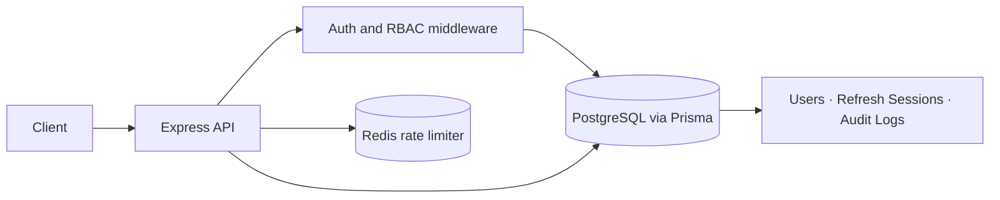
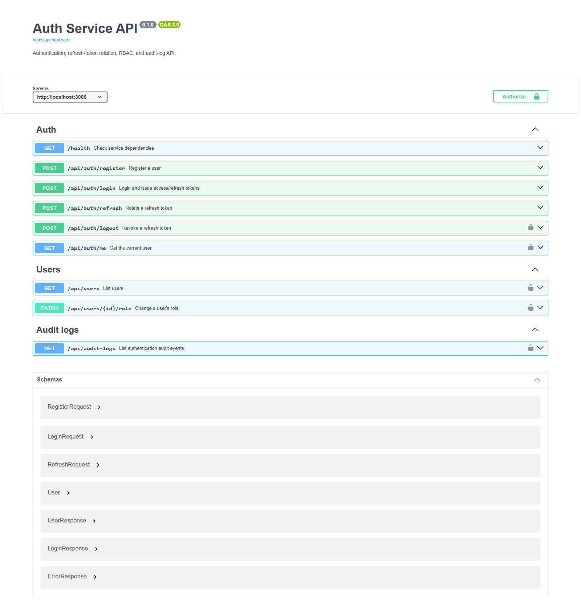

# Auth Service API


An authentication REST API built with **Express 5, TypeScript, PostgreSQL, Prisma, and Redis**. It covers the core session lifecycle—from registration and login through refresh-token rotation and logout—plus role-based access control and audit logging.

> This service currently provides its own REST authentication endpoints. It is not an OAuth/OIDC identity provider.

## Features

- Registration and login with **Argon2id** password hashing.
- **15-minute HS256 access JWTs** and **7-day opaque refresh tokens**.
- Refresh-token rotation: each token is single-use; a replay revokes the active token family.
- Refresh-token values are never stored in the database; only their SHA-256 hashes are stored.
- Redis-backed login rate limit: **5 attempts per IP per 15 minutes**. Login fails closed with `503` if Redis is unavailable.
- Bearer-token authentication and `USER` / `ADMIN` role authorization.
- Paginated admin endpoints for user management and audit logs.
- Request validation with Zod, security headers with Helmet, consistent error responses, and dependency health checks.
- Docker Compose stack for the API, PostgreSQL, and Redis.

## Architecture



## Tech stack

| Area | Technology |
| --- | --- |
| Runtime / language | Node.js 24, TypeScript |
| HTTP API | Express 5 |
| Database / ORM | PostgreSQL 16, Prisma 7 |
| Rate limiting | Redis 7, ioredis |
| Validation | Zod 4 |
| Password hashing | Argon2id |
| Tests | Node.js test runner, integration tests |
| Local infrastructure | Docker Compose |

## Quick start with Docker Compose

### Requirements

- Docker Desktop with Docker Compose
- Node.js 24+ only if you also want to run the tests or develop outside Docker

### Start the stack

In PowerShell:

```powershell
if (-not (Test-Path .env)) {
  Copy-Item .env.example .env
} else {
  Write-Host ".env already exists; keeping your current local settings."
}
```

Edit `.env` and replace `JWT_ACCESS_SECRET` with a unique secret of at least 32 characters. You can generate one locally with:

```powershell
$bytes = New-Object byte[] 48
$rng = [System.Security.Cryptography.RandomNumberGenerator]::Create()
$rng.GetBytes($bytes)
$secret = [Convert]::ToBase64String($bytes)
$rng.Dispose()
$secret
```

Paste the generated value into `.env`, then start the services:

```powershell
docker compose up --build
```

The API is available at `http://localhost:3000`. PostgreSQL and Redis are exposed on host ports `5433` and `6380` to avoid conflicts with local Laragon or Redis instances. If port `3000` is already in use, set an alternate host port for that PowerShell session before starting Compose:

```powershell
$env:APP_PORT = '3001'
docker compose up --build
```

Within Compose, the API connects to the database and Redis over the private Compose network. The app waits for both dependencies to become healthy, applies committed migrations, then starts.

Check readiness:

```powershell
Invoke-RestMethod http://localhost:3000/health | ConvertTo-Json -Depth 5
```

Expected response:

```json
{
  "data": {
    "status": "ok",
    "dependencies": {
      "postgres": "ok",
      "redis": "ok"
    }
  }
}
```

Stop the services while preserving the database volume:

```powershell
docker compose down
```

`docker compose down -v` removes the Compose database volume and its data. Use it only when you intentionally want to reset the Docker database.

## Local development with Laragon PostgreSQL

Use this option if PostgreSQL is already running locally in Laragon and Redis is available on `localhost:6379`.

1. Create the `auth_service` database in PostgreSQL.
2. Copy `.env.example` to `.env`, set `DATABASE_URL` to your Laragon connection string, and set a unique `JWT_ACCESS_SECRET` (at least 32 characters). Never commit `.env`.
3. Install dependencies, generate Prisma Client, and apply the development migration:

   ```powershell
   npm ci
   npm run db:generate
   npm run db:migrate
   ```

4. Start the API:

   ```powershell
   npm run dev
   ```

For the Redis dependency, you can run a local container if one is not already running:

```powershell
docker run --name auth-redis -p 6379:6379 -d redis:7-alpine
```

If that container name or port is already in use, keep using the existing Redis instance and make sure `REDIS_URL` in `.env` points to it.

## API reference

The complete OpenAPI 3.0 contract is available at [`docs/openapi.yaml`](docs/openapi.yaml). It can be imported into Swagger UI, Insomnia, or Postman.
When running the API, interactive Swagger UI is available at `http://localhost:3000/docs`.

Most successful responses return a `data` property; logout may return an empty `204` when there was no active session to revoke. Errors return `error.code` and `error.message` (validation errors may also include `error.details`). Protected routes require `Authorization: Bearer <accessToken>`.

| Method | Endpoint | Access | Description |
| --- | --- | --- | --- |
| `GET` | `/health` | Public | PostgreSQL and Redis health |
| `POST` | `/api/auth/register` | Public | Create a `USER` account |
| `POST` | `/api/auth/login` | Public, rate-limited | Authenticate and issue tokens |
| `POST` | `/api/auth/refresh` | Public | Rotate a refresh token |
| `POST` | `/api/auth/logout` | Bearer | Revoke the supplied refresh token |
| `GET` | `/api/auth/me` | Bearer | Get the current user profile |
| `GET` | `/api/users?page=1&limit=20` | Admin | List users |
| `PATCH` | `/api/users/:id/role` | Admin | Change a user's role |
| `GET` | `/api/audit-logs?page=1&limit=20` | Admin | List audit events |

Pagination accepts `page` (minimum `1`) and `limit` (from `1` to `100`, default `20`). New registrations always receive the `USER` role. The API intentionally has no public admin-registration endpoint.

### Register

```bash
curl -X POST http://localhost:3000/api/auth/register \
  -H 'Content-Type: application/json' \
  -d '{"name":"Demo User","email":"demo@example.com","password":"LocalDemoPass123!"}'
```

Passwords must be 12–128 characters at registration. Email is trimmed and normalized to lowercase.

### Login

```bash
curl -X POST http://localhost:3000/api/auth/login \
  -H 'Content-Type: application/json' \
  -d '{"email":"demo@example.com","password":"LocalDemoPass123!"}'
```

The response contains the user profile, an access token, and a refresh token. Store tokens securely; never commit or publish real token values. A shortened example:

```json
{
  "data": {
    "user": { "id": "<user-id>", "name": "Demo User", "email": "demo@example.com", "role": "USER" },
    "accessToken": "<redacted>",
    "refreshToken": "<redacted>"
  }
}
```

### Use a protected endpoint

```bash
curl http://localhost:3000/api/auth/me \
  -H 'Authorization: Bearer <accessToken>'
```

### Refresh and logout

Send the current refresh token to `POST /api/auth/refresh`. Save the newly returned refresh token and discard the old one. To log out, send the current access token as a Bearer token and the current refresh token in the JSON body to `POST /api/auth/logout`.

Reusing an old refresh token invalidates active sessions in its token family, so clients must replace—not reuse—the token after every successful refresh.

### Common status codes

| Status | Meaning |
| --- | --- |
| `400` | Invalid request body or pagination parameters |
| `401` | Missing/invalid access token or invalid credentials/refresh token |
| `403` | Authenticated user does not have the required admin role |
| `409` | Email is already registered |
| `429` | Login rate limit exceeded |
| `503` | A required service, such as Redis, is unavailable |

## Admin access for local development

The application does not seed a default admin or provide a public endpoint to create one. Create/promote a development admin directly in your **local** database using a secure password. Do not hard-code demo credentials in source code, and do not reuse local demo credentials in a hosted environment.

## Tests and quality checks

```powershell
npm run typecheck
npm test
npm run build
npm audit
```

The integration test requires a migrated PostgreSQL database and reachable Redis configured in `.env`. It creates a unique temporary user and deletes that user afterward. Audit-log rows are retained with the user reference set to `null`.

The dependency tree includes explicit patched-version overrides for Prisma CLI transitive dependencies. The current `npm audit` is clean; retest Prisma generation and migrations whenever updating Prisma, and remove the overrides once Prisma updates its upstream dependency pins.

## Project structure

```text
prisma/                 Prisma schema and migrations
src/config/             PostgreSQL and Redis clients
src/middlewares/        Authentication, RBAC, validation, rate limiting, errors
src/modules/auth/       Registration, login, refresh, logout, profile
src/modules/user/       Admin user and audit-log endpoints
src/utils/              Password and token utilities
tests/                  Authentication integration test
Dockerfile              API image
docker-compose.yml      Local API + PostgreSQL + Redis stack
```

## Security scope

Before exposing this service to the public internet, use HTTPS, production-grade secrets and database credentials, restricted network access, backups, and monitoring. The project does not currently implement email verification, password reset, OAuth/OIDC client registration, or account-recovery workflows, so it is not a general-purpose identity provider.

## License

No license has been selected. Until a `LICENSE` file is added, do not assume others have permission to reuse or redistribute this code.

## Project documentation

- [Architecture and data model](ARCHITECTURE.md)
- [Detailed API reference](API.md)
- [Security policy and limitations](SECURITY.md)
- [Changelog](CHANGELOG.md)

### Live API documentation

Captured from the running local API at `/docs`:


